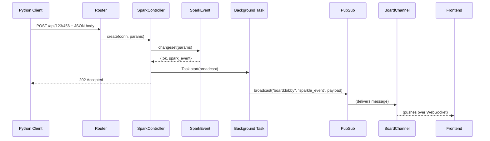

# 📡 Backend Specification: The Phoenix Spark

## 1. 🎯 Goal & Principles

The backend is designed to be a highly concurrent, low-latency ingestion and broadcasting engine for real-time events.

- **Principle 1: High Concurrency & Low Latency:** Built on Elixir/OTP to handle a high volume of incoming HTTP requests with minimal response time, ensuring the client is never blocked.
- **Principle 2: Asynchronous Processing:** Immediately accept and validate API requests, then delegate the real-time broadcasting to a non-blocking background task.
- **Principle 3: Robust Validation:** Employ a strong data contract (`SparkEvent`) with a changeset-based validation layer to ensure data integrity before broadcasting.

## 2. 🏛️ System Architecture

The backend follows standard Phoenix patterns, with a clear separation of concerns between components.

| Component | Module | Responsibility |
| :--- | :--- | :--- |
| **Endpoint** | `SparkPhoenixWeb.Endpoint` | The application's entry point. Manages static file serving and socket connections. |
| **Router** | `SparkPhoenixWeb.Router` | Defines the API scope and routes the `POST /api/:x/:y` path to the `SparkController`. |
| **Controller** | `SparkPhoenixWeb.SparkController` | Handles the HTTP request, orchestrates validation, and triggers the asynchronous broadcast. |
| **Data Contract** | `SparkPhoenix.SparkEvent` | Defines the `SparkEvent` struct and uses an `Ecto.Changeset` to validate incoming data, acting as the single source of truth for the event data model. |
| **User Socket** | `SparkPhoenixWeb.UserSocket` | Defines the WebSocket connection endpoint and routes topics to the appropriate channel. |
| **Channel** | `SparkPhoenixWeb.BoardChannel` | Manages client subscriptions to the `board:lobby` topic. |
| **PubSub** | `Phoenix.PubSub` | The underlying publish-subscribe mechanism used by the Endpoint to broadcast messages to all channel subscribers. |

## 3. ⚡ API Endpoint: `POST /api/:x/:y`

This is the sole endpoint for ingesting spark events.

### Request Flow

1. An HTTP POST request is sent to a coordinate-based URL (e.g., `/api/123/456`).
2. The `Router` dispatches the connection (`conn`) to `SparkController.create/2`.
3. The `SparkController` merges the `:x` and `:y` path parameters with the JSON request body.
4. The combined parameters are passed to the `SparkEvent.changeset/1` function for validation.
5. **On Success (Valid Data):**
    - A background `Task` is immediately spawned to handle the broadcast.
    - The controller sends a `202 Accepted` HTTP response back to the client.
    - The background task calls `Endpoint.broadcast`, publishing the event to the `board:lobby` topic.
6. **On Failure (Invalid Data):**
    - The controller immediately sends a `400 Bad Request` response with a JSON body detailing the validation errors from the changeset.

### Parameters

| Type | Name | Format | Source |
| :--- | :--- | :--- | :--- |
| **Path** | `x`, `y` | Integer (0-511) | URL Path |
| **Body** | `color`, `radius`, `transparency`, `time_to_grow` | JSON Object | HTTP Request Body |

## 4. 🛡️ Data Validation (`SparkEvent`)

To ensure data integrity and provide clear error messages, we use a dedicated `SparkEvent` module that acts as a data contract, similar in concept to a Pydantic model or a Data Transfer Object.

- **Structure:** An `embedded_schema` defines the fields (`x`, `y`, `color`, etc.) and their Elixir types (`:integer`, `:float`, `{:array, :float}`).
- **Validation:** A `changeset/1` function casts and validates the raw input parameters against the schema's types and a set of rules (`validate_required`, `validate_number`, etc.).
- **Serialization:** The struct derives the `Jason.Encoder` protocol, allowing it to be automatically converted to JSON for the API response and WebSocket broadcast.

## 5. 📢 Real-Time Broadcasting

Broadcasting is designed to be non-blocking to meet the low-latency requirement.

- **Asynchronicity:** The `SparkController` uses `Task.start(fn -> ... end)` to immediately spin up a lightweight, concurrent process for the broadcast, ensuring the HTTP response is not delayed.
- **Delivery:** This background task calls `SparkPhoenixWeb.Endpoint.broadcast/3`, which uses the application's configured `PubSub` server to send the message to all connected clients subscribed to the `board:lobby` topic.
- **Payload:** The message is sent with the event name `sparkle_event` and a payload of the shape `%{data: %SparkEvent{...}}`.

## 6. 📊 Architecture Diagram

A sequence diagram illustrating the flow from client request to frontend broadcast.

