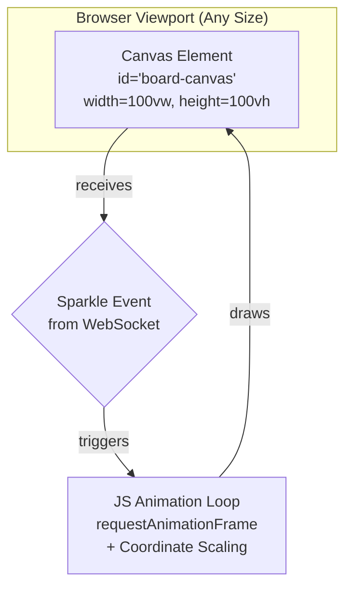

# 🎨 UI/UX Specification: The Phoenix Spark (v3 - Fullscreen)

## 1. 🎯 Goal & Principles

The primary goal is to provide a clean, high-performance, and immersive canvas for visualizing high-volume API activity in real-time.

- **Principle 1: Minimalist Aesthetics:** Focus the user's attention entirely on the spark effects on a plain black, borderless canvas that fills the viewport.
- **Principle 2: High Performance:** Utilize the HTML Canvas API and `requestAnimationFrame` for rendering to ensure smooth animation and low overhead, even with hundreds of concurrent sparks.
- **Principle 3: Scaled Coordinates:** The backend's 512x512 coordinate system is scaled to fit the browser viewport, preserving the relative shape of the visual patterns regardless of screen size or aspect ratio.

## 2. 🖥️ Screen Structure: The Canvas Viewer

The application consists of a single, full-screen canvas.

| Element | Description | Specification |
| :--- | :--- | :--- |
| **Viewport Layout** | The canvas fills the entire browser viewport. | A plain black background with the canvas overlaid to cover 100% of the viewport width and height. |
| **Canvas Element** | The rendering surface where sparks are drawn. | ID: `board-canvas`. Resolution: Dynamically sized to match the browser viewport. |

## 3. 💥 Interaction Design (The Sparkle Effect)

The animation is rendered on the canvas using a JavaScript animation loop and a scaled coordinate system.

### 3.1. The Spark Animation (Canvas Rendering)

| Animation Step | Trigger | Visual Effect & Canvas API Logic |
| :--- | :--- | :--- |
| **Start (Event Received)** | JS receives `sparkle_event` via Phoenix Channel. | The incoming 512x512 coordinates are scaled to the current viewport dimensions. A new "spark" object is created with the scaled position, color, and animation parameters. This object is pushed to an `activeSparks` array. The `requestAnimationFrame` loop is initiated. |
| **Animation Loop (per frame)** | `requestAnimationFrame` callback fires. | The entire canvas is cleared (`ctx.clearRect`). The code iterates through every spark in the `activeSparks` array. For each spark, it calculates the `currentRadius` and `currentOpacity` based on the elapsed time. A circle is drawn on the canvas at the spark's scaled (x, y) coordinate using `ctx.arc()`. |
| **End (Animation Completes)** | A spark's `elapsedTime` exceeds its `duration`. | The spark is no longer drawn and is removed from the `activeSparks` array. The animation loop continues as long as `activeSparks` is not empty. |

### 3.2. Parameter Mapping (POST Body to Canvas)

| POST Parameter | Canvas/JS Target | Notes |
| :--- | :--- | :--- |
| `color` | A list of 3 numbers for HSL color `[hue, saturation, lightness]`. | Used to set `ctx.fillStyle` as an `hsl()` string. e.g., `[0, 100, 50]` becomes `hsl(0, 100%, 50%)`. |
| `radius` | The `maxRadius` property of the spark object. | Controls the maximum radius of the circle. This value is scaled based on the viewport size to ensure a consistent visual appearance. |
| `transparency` | The `initialOpacity` of the spark object. | Sets the starting `ctx.globalAlpha` for the spark, which then fades to 0. A value from 0.0 to 1.0. |
| `time_to_grow` | The `duration` property of the spark object. | Controls the total duration of the animation loop for that spark, in milliseconds. |

## 4. 🖼️ Wireframe (Conceptual Representation)

The UI is a single, full-screen canvas that adapts to the viewport.

